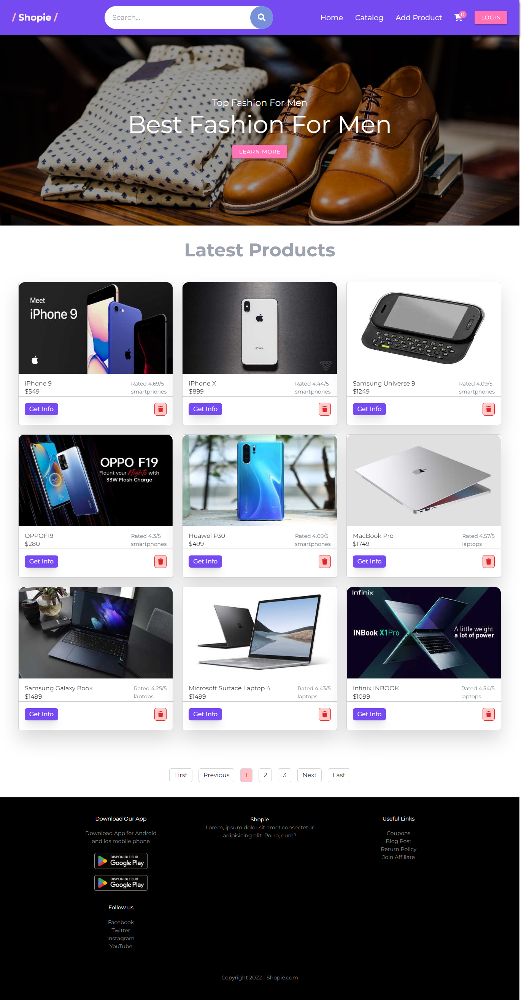

# Ecommerce Website
[See live site here](https://e-commerce-app-vue.netlify.app/home)
## Project setup

```
# npm
npm install
```

### Compiles and hot-reloads for development

```
# npm
npm run dev
```

### Compiles and minifies for production

```
# npm
npm run build
```
### Front-End Development Deliverables
- Web Design 
- Website Development
- Web Application

### Front-End Development Technologies
- Vuejs
- Vuex
- Vuetify
- JavaScript 
- CSS3
- HTML5
- Bootstrap
- Tailwind
- Font Awesome
- Git
- Github
- Netlify

## Project description :
 Nowadays the shift in focus of sales operations for goods and services from hand-to-hand to virtual sales is driving us to put greater emphasis on electronic selling. 
 For years, online stores have been widely advised for businesses that rely on the selling of goods and services. These types of websites serve as a global device that connects clients to all relevant information, products, and services through a single portal.
 This online shopping site allows customers to take advantage of the available virtual fair which is updated daily without the slightest constraint, which will allow them to never miss their favorites, without problems of geographical distance, working hours or availability of transport. On the other hand, this site allows the company to take advantage of this space to expose its products to a wider customer base.
 **So, as a developer, I was asked to design and create an E-commerce web site for electronic devices which facilitates the communication between the product owners and the clients**.

N.B: The work is done with the following technologies
- Frontend: Html5 - Css3 - Javascript - Vuejs - Vuex - Vuetify - Bootstrap - Tailwind - Git - Github - Netlify.

At the end of the project I managed to achieve a great success with a well-made platform while respecting the specifications and making our client very satisfied with the result.

## Ecommerce Website Preview :

###### The main page of ecommerce website



###### The authentication page of ecommerce website


###### The catalog page of ecommerce website


###### The category products page of ecommerce website


###### The Product details Page


###### The Shopping Cart Page


###### The Add Product Page


